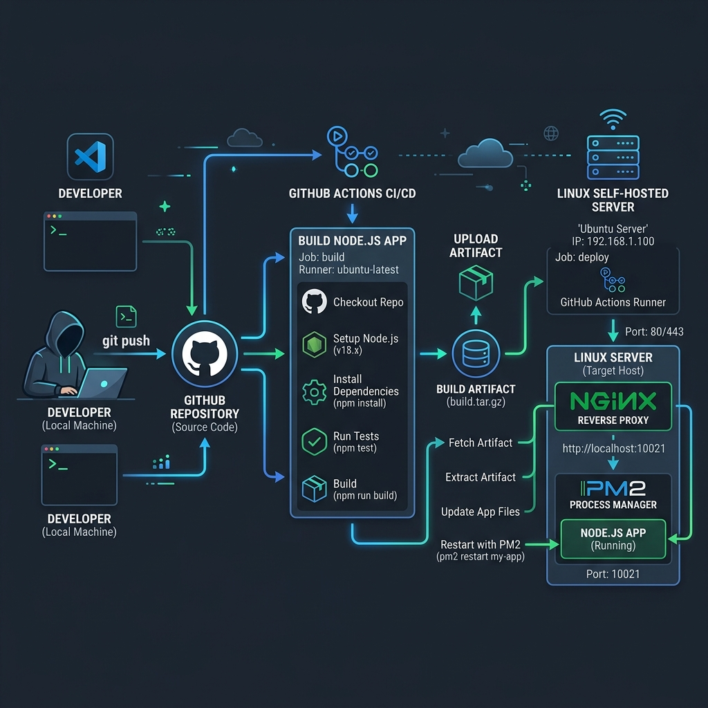

# 🚀 Server Deployment Template (Nuxt, React, Rust & Go)

[](#)
[](#)
[](#)
[](#)
[](#)
[](#)
[](#)

Templat otomatisasi CI/CD tingkat lanjut untuk deploy aplikasi **Nuxt**, **React**, **Rust**, dan **Go** menggunakan **GitHub Actions** (dengan **Go Cache** / **rust-cache**), **Self-Hosted Runner**, **PM2**, dan **Nginx Reverse Proxy**.

---

## 📋 Daftar Isi

- [📐 Arsitektur Sistem](#-arsitektur-sistem)
- [📁 Struktur Direktori](#-struktur-direktori)
- [🛠️ Panduan Step-by-Step Deployment](#%EF%B8%8F-panduan-step-by-step-deployment)
  - [Langkah 1: Konfigurasi Environment & Variables](#langkah-1-konfigurasi-environment--variables)
  - [Langkah 2: Menyiapkan GitHub Actions Workflow](#langkah-2-menyiapkan-github-actions-workflow)
  - [Langkah 3: Konfigurasi Self-Hosted Runner & Deploy Script](#langkah-3-konfigurasi-self-hosted-runner--deploy-script)
  - [Langkah 4: Konfigurasi Nginx Reverse Proxy](#langkah-4-konfigurasi-nginx-reverse-proxy)
- [✅ Checklist Progress Deployment](#-checklist-progress-deployment)
- [❓ FAQs & Troubleshooting](#-faqs--troubleshooting)

---

## 📐 Arsitektur Sistem

```mermaid
flowchart LR
    A[💻 Developer Push] -->|Git Push main| B[🐙 GitHub Repository]
    subgraph GitHub Cloud
        B --> C[⚙️ GitHub Actions Build Job]
        C -->|npm build / cargo build| D[📦 Upload Artifact]
    end
    subgraph Self-Hosted Server
        D -->|Download Artifact| E[🏃 Self-Hosted Runner]
        E -->|Run deploy.sh| F[⚡ PM2 Process Manager]
        F -->|Serves App Port 10021 / 10030| G[🌐 Nginx Reverse Proxy]
    end
    G -->|HTTPS Port 80/443| H[👥 End User / Client]
```





---

## 📁 Struktur Direktori

```text
SERVER/
├── 📁 backend/
│   ├── 📁 go/
│   │   ├── 📄 deploy.yaml        # GitHub Actions Workflow (Go dengan cache: true)
│   │   ├── 📄 deploy.sh          # Shell deployment script (PM2 / Binary)
│   │   ├── 📄 nginx.conf         # Server configuration template (Go API)
│   │   └── 📄 command-nginx.sh   # Perintah setup & restart Nginx
│   └── 📁 rust/
│       ├── 📄 deploy.yaml        # GitHub Actions Workflow (Rust dengan rust-cache)
│       ├── 📄 deploy.sh          # Shell deployment script (PM2 / Binary)
│       ├── 📄 nginx.conf         # Server configuration template (Rust API)
│       └── 📄 command-nginx.sh   # Perintah setup & restart Nginx
├── 📁 frontend/
│   ├── 📁 nuxt/
│   │   ├── 📄 deploy.yaml        # GitHub Actions Workflow (Nuxt)
│   │   ├── 📄 deploy.sh          # Shell deployment script (PM2)
│   │   ├── 📄 nginx.conf         # Server configuration template
│   │   └── 📄 command-nginx.sh   # Perintah setup & restart Nginx
│   └── 📁 react/
│       ├── 📄 deploy.yaml        # GitHub Actions Workflow (React)
│       ├── 📄 deploy.sh          # Shell deployment script (PM2)
│       ├── 📄 nginx.conf         # Server configuration template
│       └── 📄 command-nginx.sh   # Perintah setup & restart Nginx
└── 📁 docs/
    └── 📁 images/                # Ilustrasi & Diagram Step-by-Step
```

---

## 🛠️ Panduan Step-by-Step Deployment

### Langkah 1: Konfigurasi Environment & Variables

Sebelum menjalankan workflow CI/CD, Anda perlu menentukan variabel dan secrets di GitHub Repository.


<details>
<summary>🔍 <b>Klik untuk melihat daftar variabel yang dibutuhkan</b></summary>

<br/>

| Tipe Variable | Nama Variable | Deskripsi | Contoh Nilai |
|---|---|---|---|
| **Variables** | `DEPLOY_PATH` | Path direktori di server tempat aplikasi dideploy | `/var/www/bram-innovation` |
| **Variables** | `ARTIFACT_PATH` | Daftar file/folder build yang di-upload | `dist`<br>`package.json`<br>`package-lock.json` |
| **Secrets / Variables** | `ENV` / `ENV_CONTENT` | Isi dari file `.env` produksi | `PORT=10021`<br>`NODE_ENV=production` |

</details>

> [!IMPORTANT]
> Properti `path` pada `upload-artifact` di workflow sudah dikonfigurasi untuk membaca dari `${{ vars.ARTIFACT_PATH }}` secara dinamis.

---

### Langkah 2: Menyiapkan GitHub Actions Workflow

Pilih file `deploy.yaml` sesuai dengan framework atau bahasa yang Anda gunakan ([Nuxt](file:///c:/Users/Yuu/Documents/SERVER/frontend/nuxt/deploy.yaml), [React](file:///c:/Users/Yuu/Documents/SERVER/frontend/react/deploy.yaml), [Rust](file:///c:/Users/Yuu/Documents/SERVER/backend/rust/deploy.yaml), atau [Go](file:///c:/Users/Yuu/Documents/SERVER/backend/go/deploy.yaml)), lalu tempatkan di lokasi `.github/workflows/deploy.yml` proyek Anda.

<details>
<summary>📜 <b>Lihat Struktur file deploy.yaml</b></summary>

```yaml
name: Deploy Application

on:
  push:
    branches:
      - main

env:
  ENV_NAME: bram-innovation

jobs:
  build:
    runs-on: ubuntu-latest
    environment: ${{ env.ENV_NAME }}

    steps:
      - name: Checkout repository
        uses: actions/checkout@v4

      - name: Setup Node.js
        uses: actions/setup-node@v4
        with:
          node-version: 20
          cache: 'npm'

      - name: Install dependencies
        run: npm i

      - name: Build application
        run: npm run build

      - name: Upload build artifacts
        uses: actions/upload-artifact@v4
        with:
          name: build-artifact
          include-hidden-files: true
          path: ${{ vars.ARTIFACT_PATH }}

  deploy:
    needs: build
    runs-on: self-hosted
    environment: ${{ env.ENV_NAME }}

    steps:
      - name: Download build artifacts
        uses: actions/download-artifact@v4
        with:
          name: build-artifact
          path: ${{ vars.DEPLOY_PATH }}

      - name: Execute deploy script
        env:
          ENV_CONTENT: ${{ secrets.ENV || vars.ENV }}
        run: |
          cd ${{ vars.DEPLOY_PATH }} && bash script/deploy.sh
```

</details>

---

### Langkah 3: Konfigurasi Self-Hosted Runner & Deploy Script

Pada job `deploy`, GitHub Actions Self-Hosted Runner di server Linux akan mengeksekusi file `deploy.sh`.


<details>
<summary>⚡ <b>Penjelasan Alur Kerja deploy.sh</b></summary>

1. **Auto .env Generation**: Menulis `ENV_CONTENT` dari GitHub Secrets/Vars ke file `.env` lokal.
2. **NVM & Node Auto-Detection**: Secara otomatis memuat NVM dan Node.js versi terbaru yang terinstall.
3. **PM2 Zero-Downtime Management**: Menjalankan atau merestart process PM2 secara mode SPA di port `10021`.
4. **PM2 Save State**: Menyimpan daftar proses PM2 agar otomatis restart saat server reboot.

```bash
#!/bin/bash
set -e

# Pindah ke direktori utama proyek
SCRIPT_DIR="$(cd "$(dirname "${BASH_SOURCE[0]}")" && pwd)"
PROJECT_DIR="$(dirname "$SCRIPT_DIR")"
cd "$PROJECT_DIR"

# Tulis file .env jika ada ENV_CONTENT
if [ -n "$ENV_CONTENT" ]; then
    printf '%s\n' "$ENV_CONTENT" > .env
fi

export PORT=10021
export NODE_ENV=production
APP_NAME="bram-innovation"

# Load NVM & Node/PM2 PATH
export NVM_DIR="$HOME/.nvm"
if [ -s "$NVM_DIR/nvm.sh" ]; then
    source "$NVM_DIR/nvm.sh" > /dev/null 2>&1
fi

# Restart PM2 atau start baru
pm2 restart "$APP_NAME" --update-env > /dev/null 2>&1 || pm2 serve ./dist --port "$PORT" --name "$APP_NAME" --spa > /dev/null 2>&1
pm2 save > /dev/null 2>&1
```

</details>

> [!TIP]
> Script `deploy.sh` berjalan secara **silent** sehingga log output GitHub Actions tetap bersih dan rapi.

---

### Langkah 4: Konfigurasi Nginx Reverse Proxy

Gunakan templat `nginx.conf` untuk mengarahkan domain publik ke aplikasi Node.js yang berjalan di `localhost:10021`. Perintah eksekusi Nginx tersedia secara terpisah pada file `command-nginx.sh`.

<details>
<summary>🛠️ <b>Perintah Konfigurasi Nginx (command-nginx.sh)</b></summary>

```bash
# 1. Buat file konfigurasi di sites-available
sudo nano /etc/nginx/sites-available/braminnovation

# 2. Buat symlink ke sites-enabled
sudo ln -s /etc/nginx/sites-available/braminnovation /etc/nginx/sites-enabled/

# 3. Uji konfigurasi syntax Nginx
sudo nginx -t

# 4. Restart service Nginx
sudo systemctl restart nginx
```

```nginx
server {
    listen 80;
    server_name braminnovation.com;

    location / {
        proxy_pass http://localhost:10021;
        proxy_http_version 1.1;
        proxy_set_header Upgrade $http_upgrade;
        proxy_set_header Connection 'upgrade';
        proxy_set_header Host $host;
        proxy_cache_bypass $http_upgrade;        
        proxy_set_header X-Real-IP $remote_addr;
        proxy_set_header X-Forwarded-For $proxy_add_x_forwarded_for;
        proxy_set_header X-Forwarded-Proto $scheme;
        proxy_connect_timeout 60s;
        proxy_send_timeout 60s;
        proxy_read_timeout 60s;
    }
}
```

</details>

---

## ✅ Checklist Progress Deployment

Gunakan checklist ini untuk memastikan seluruh konfigurasi telah diselesaikan:

- [ ] **GitHub Runner**: Self-hosted runner terpasang & berstatus `Idle` di server.
- [ ] **Repository Variables**: Variable `DEPLOY_PATH` dan `ARTIFACT_PATH` sudah diisi.
- [ ] **Repository Secrets**: Variable `ENV` / `ENV_CONTENT` sudah diset di GitHub.
- [ ] **PM2 Installed**: Utility `pm2` sudah terinstall secara global di server (`npm install -g pm2`).
- [ ] **Nginx Configured**: Config `nginx.conf` telah di-symlink dan di-reload (`sudo nginx -t`).
- [ ] **First Deploy**: Commit dan push ke branch `main` untuk verifikasi otomatisasi.

---

## ❓ FAQs & Troubleshooting

<details>
<summary>❓ <b>1. Bagaimana jika PM2 gagal menemukan komando Node/npm di Self-Hosted Runner?</b></summary>

> [!NOTE]
> Script `deploy.sh` sudah memiliki auto-detect path NVM (`$HOME/.nvm`). Pastikan NVM terinstall pada user linux yang menjalankan GitHub Actions runner service.
</details>

<details>
<summary>❓ <b>2. Mengapa artifact path menggunakan ${{ vars.ARTIFACT_PATH }}?</b></summary>

> [!NOTE]
> Menggunakan variable membuat workflow fleksibel tanpa perlu hardcode folder build (`dist`, `build`, `.output`, `package.json`, dll.) di dalam file YAML.
</details>

<details>
<summary>❓ <b>3. Bagaimana cara mengecek log aplikasi di server?</b></summary>

```bash
# Cek log aplikasi via PM2
pm2 logs bram-innovation

# Cek status proses PM2
pm2 status
```
</details>

---

<div align="center">
  <sub>Developed with ❤️ for seamless CI/CD Automation</sub>
</div>
