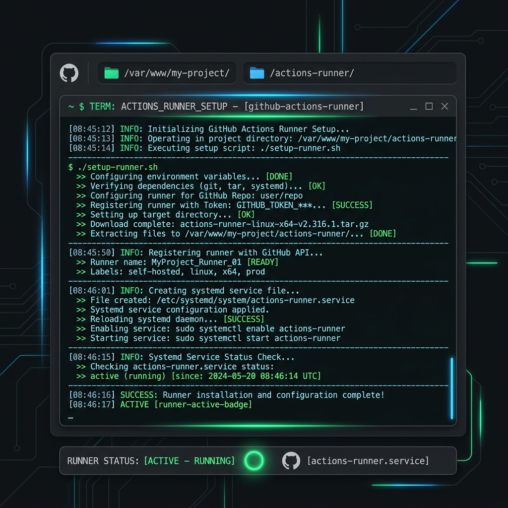
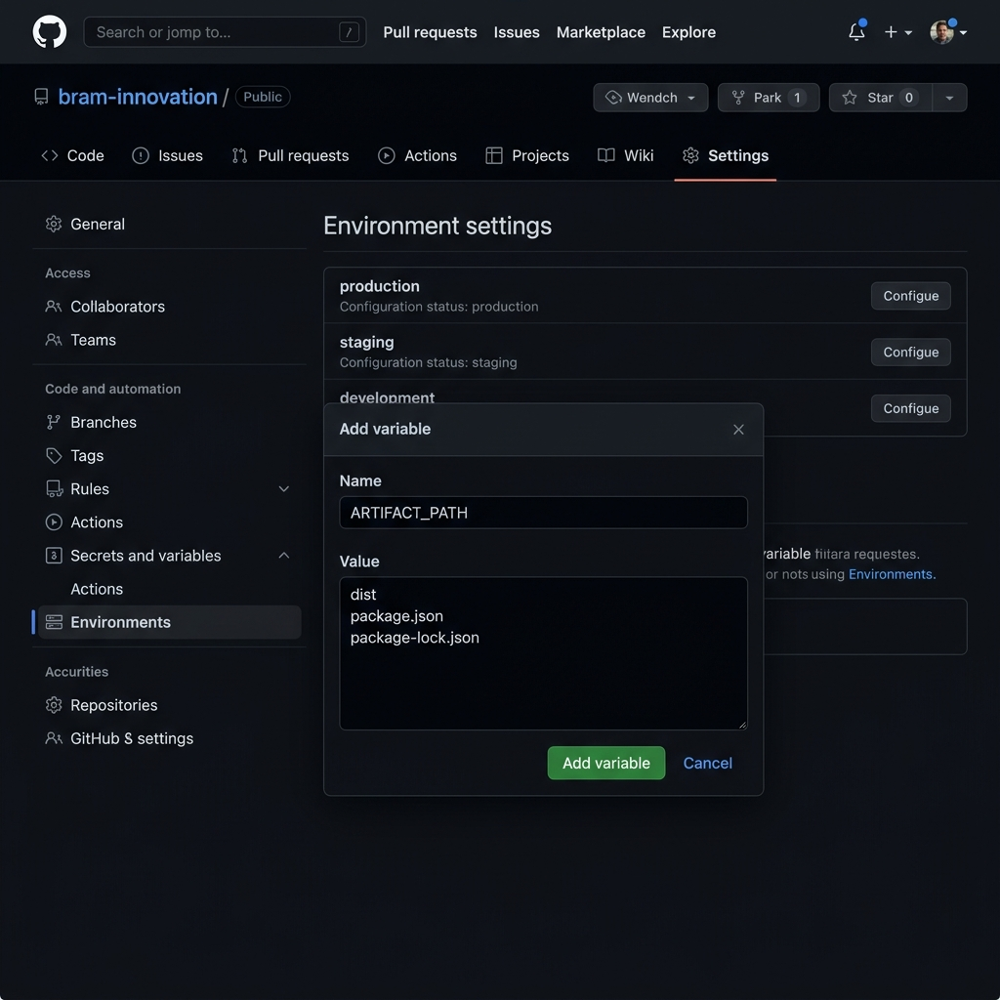
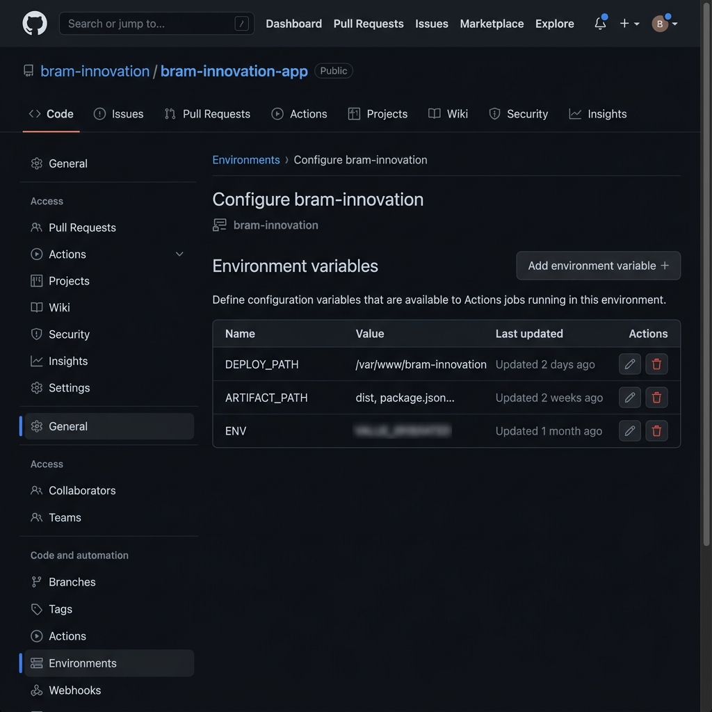
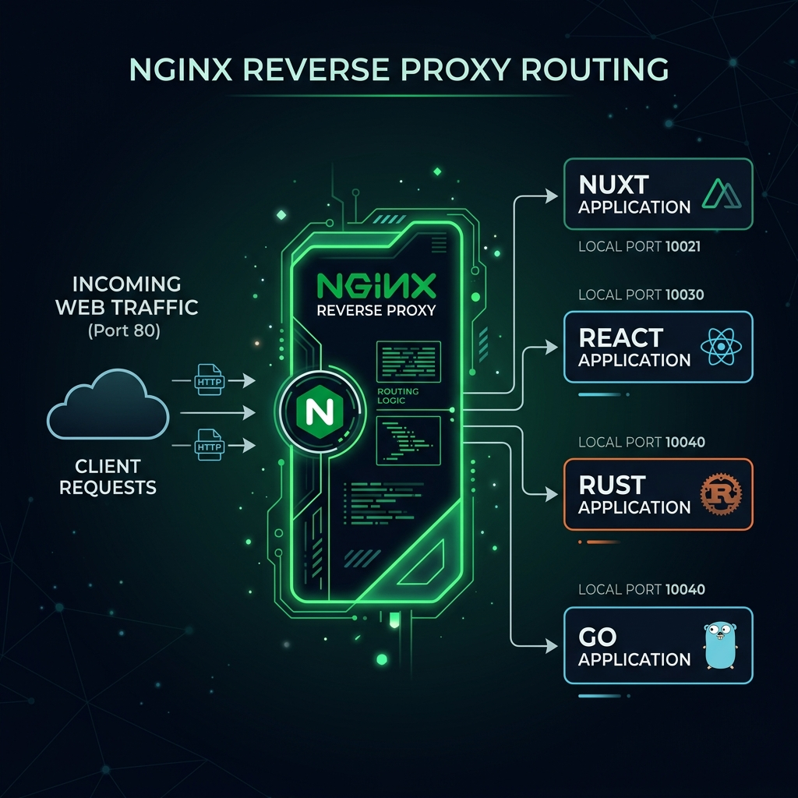
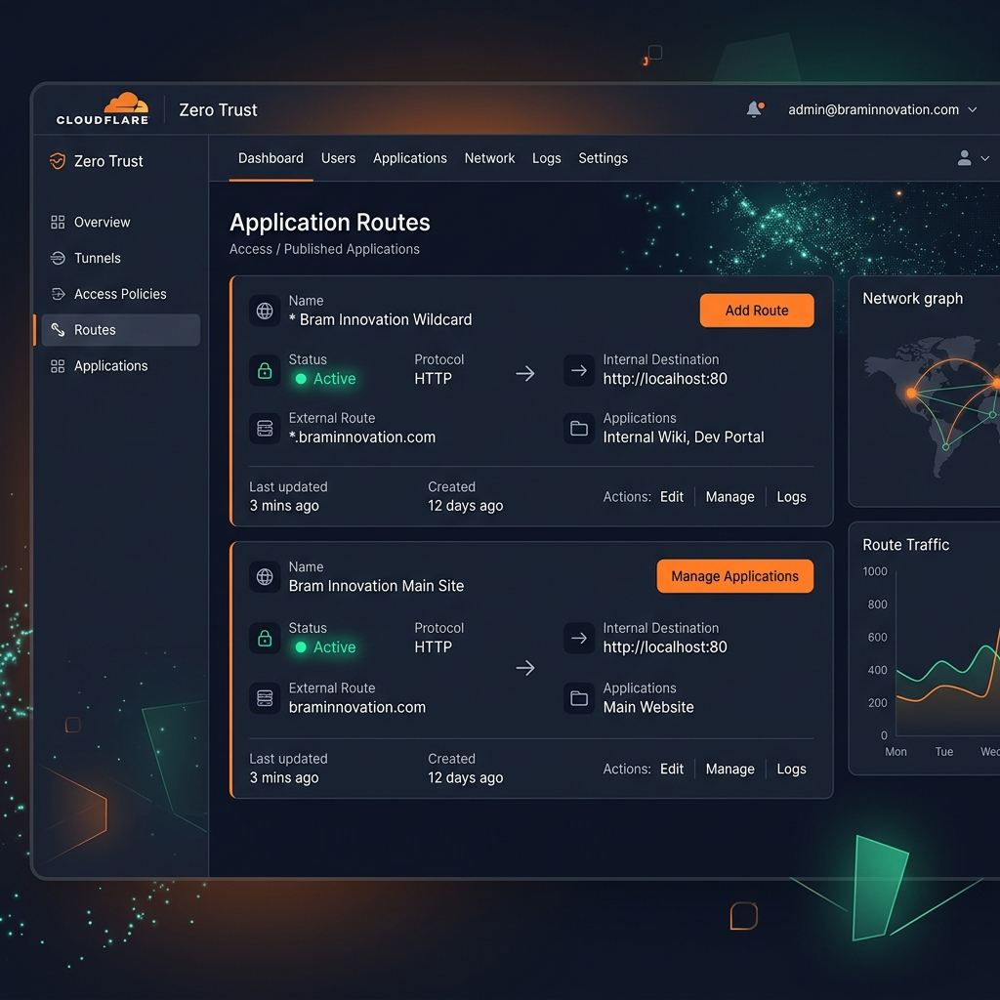

# 🚀 Server Deployment Template (Nuxt, React, Rust & Go)

[](#)
[](#)
[](#)
[](#)
[](#)
[](#)
[](#)

Templat otomatisasi CI/CD serbaguna untuk deploy aplikasi **Nuxt**, **React**, **Rust**, dan **Go** menggunakan **GitHub Actions**, **Self-Hosted Runner**, **PM2**, **Nginx Reverse Proxy**, dan **Cloudflare Tunnel**.

---

## 📁 Struktur Direktori

```text
SERVER/
├── 📄 setup-runner.sh        # Script instalasi GitHub Runner per folder project
├── 📁 backend/
│   ├── 📁 go/                # Template Go (deploy.yaml, deploy.sh, nginx.conf, command-nginx.sh)
│   └── 📁 rust/              # Template Rust (deploy.yaml, deploy.sh, nginx.conf, command-nginx.sh)
├── 📁 frontend/
│   ├── 📁 nuxt/              # Template Nuxt (deploy.yaml, deploy.sh, nginx.conf, command-nginx.sh)
│   └── 📁 react/             # Template React (deploy.yaml, deploy.sh, nginx.conf, command-nginx.sh)
└── 📁 docs/
    └── 📁 images/            # Ilustrasi & Diagram Step-by-Step
```

---

## 🛠️ Panduan Step-by-Step Deployment

### Langkah 1: Install GitHub Runner di Folder per Project



Jalankan script `setup-runner.sh` di server Linux untuk menginstall runner khusus ke folder project tertentu (misal: `/var/www/nama-project/actions-runner`):

```bash
# Format: bash setup-runner.sh <REPO_URL> <RUNNER_TOKEN> [RUNNER_DIR]
bash setup-runner.sh https://github.com/OWNER/REPO TOKEN_DARI_GITHUB /var/www/nama-project/actions-runner
```
*Dapatkan token di GitHub: **Settings > Actions > Runners > New self-hosted runner**.*

Script ini secara otomatis:
- Mengunduh & mengekstrak package runner terbaru
- Mengkonfigurasi runner ke repository proyek Anda
- Memasang & menjalankan runner sebagai **Systemd Service** (berjalan di background & auto-start saat reboot)

---

### Langkah 2: Konfigurasi GitHub Variables & Secrets



Atur nilai berikut di GitHub Repository (**Settings > Secrets and variables > Actions** atau **Settings > Environments > Configure environment**):

| Tipe Variable | Nama Variable | Deskripsi / Contoh Nilai |
|---|---|---|
| **Variables** | `DEPLOY_PATH` | Path direktori tempat app dideploy (misal: `/var/www/nama-project`) |
| **Variables** | `ARTIFACT_PATH` | Isi dengan `.` (titik) untuk **mengambil semua file langsung**, atau daftar spesifik (`dist`, `package.json`, dll.) |

> [!TIP]
> **Cara Langsung Mengambil Semua File:**
> Isi nilai `ARTIFACT_PATH` dengan cukup satu karakter **`.` (titik)**. GitHub Actions akan meng-upload seluruh file dan folder proyek sekaligus tanpa perlu didaftarkan satu per satu. File `deploy.yaml` juga sudah dilengkapi fallback otomatis `${{ vars.ARTIFACT_PATH || '.' }}`.

<details>
<summary>🖼️ <b>[Klik Pratinjau Popup] Contoh Pengisian ARTIFACT_PATH pada Modal GitHub</b></summary>

<br/>


**Pilihan 1 — Mengambil Semua File Langsung (Rekomendasi):**
```text
.
```

**Pilihan 2 — Spesifik Baris demi Baris:**
- **React (Vite)**: `dist`, `package.json`, `package-lock.json`
- **Nuxt**: `.output`, `package.json`, `package-lock.json`
- **Go / Rust**: `main`, `script`

</details>

<details>
<summary>🖼️ <b>[Klik Pratinjau Popup] Tampilan Daftar Environment Variables di Settings</b></summary>

<br/>



</details>

---

### Langkah 3: Setup Workflow CI/CD


Salin file `deploy.yaml` dari folder templat yang sesuai ([Nuxt](file:///c:/Users/Yuu/Documents/SERVER/frontend/nuxt/deploy.yaml), [React](file:///c:/Users/Yuu/Documents/SERVER/frontend/react/deploy.yaml), [Rust](file:///c:/Users/Yuu/Documents/SERVER/backend/rust/deploy.yaml), atau [Go](file:///c:/Users/Yuu/Documents/SERVER/backend/go/deploy.yaml)) ke `.github/workflows/deploy.yml` di repository proyek Anda.

```yaml
name: Deploy Application

on:
  push:
    branches:
      - main

jobs:
  build:
    runs-on: ubuntu-latest
    environment: bram-innovation

    steps:
      - name: Checkout repository
        uses: actions/checkout@v4

      # (Step build sesuai framework: Node.js / Cargo / Go)

      - name: Upload build artifacts
        uses: actions/upload-artifact@v4
        with:
          name: build-artifact
          include-hidden-files: true
          path: ${{ vars.ARTIFACT_PATH || '.' }}

  deploy:
    needs: build
    runs-on: self-hosted
    environment: bram-innovation

    steps:
      - name: Download build artifacts
        uses: actions/download-artifact@v4
        with:
          name: build-artifact
          path: ${{ vars.DEPLOY_PATH }}

      - name: Execute deploy script
        env:
          ENV_CONTENT: ${{ secrets.ENV || vars.ENV }}
        run: |
          cd ${{ vars.DEPLOY_PATH }} && bash script/deploy.sh
```

---

### Langkah 4: Setup Nginx Reverse Proxy



1. Gunakan templat `nginx.conf` dari folder templat sebagai acuan konfigurasi site Nginx.
2. Jalankan perintah dari `command-nginx.sh` untuk mengaktifkan reverse proxy:

```bash
# 1. Buat file konfigurasi Nginx
sudo nano /etc/nginx/sites-available/nama-project

# 2. Buat symlink ke sites-enabled
sudo ln -s /etc/nginx/sites-available/nama-project /etc/nginx/sites-enabled/

# 3. Uji syntax & restart service Nginx
sudo nginx -t
sudo systemctl restart nginx
```

---

### Langkah 5: Konfigurasi Cloudflare Tunnel



Arahkan domain dan wildcard subdomain pada dashboard Cloudflare Zero Trust (Public Application Routes) ke Nginx server (`http://localhost:80`):

| Published Application Route | Path | Service URL | Keterangan |
|---|---|---|---|
| `braminnovation.com` | `*` | `http://localhost:80` | Traffic utama domain ke Nginx |
| `*.braminnovation.com` | `*` | `http://localhost:80` | Traffic wildcard subdomain ke Nginx |

> [!NOTE]
> Dengan mengarahkan Cloudflare Tunnel ke `http://localhost:80`, Nginx akan secara otomatis menangani routing virtual host berdasarkan `server_name` ke port aplikasi yang sesuai (PM2 / Node / Rust / Go).

---

## ⚡ Quick Reference Perintah Runner Service

```bash
# Masuk ke folder runner project
cd /var/www/nama-project/actions-runner

# Perintah Service:
sudo ./svc.sh status     # Cek status runner
sudo ./svc.sh start      # Jalankan service runner
sudo ./svc.sh stop       # Hentikan service runner
sudo ./svc.sh uninstall  # Uninstall service runner
```
